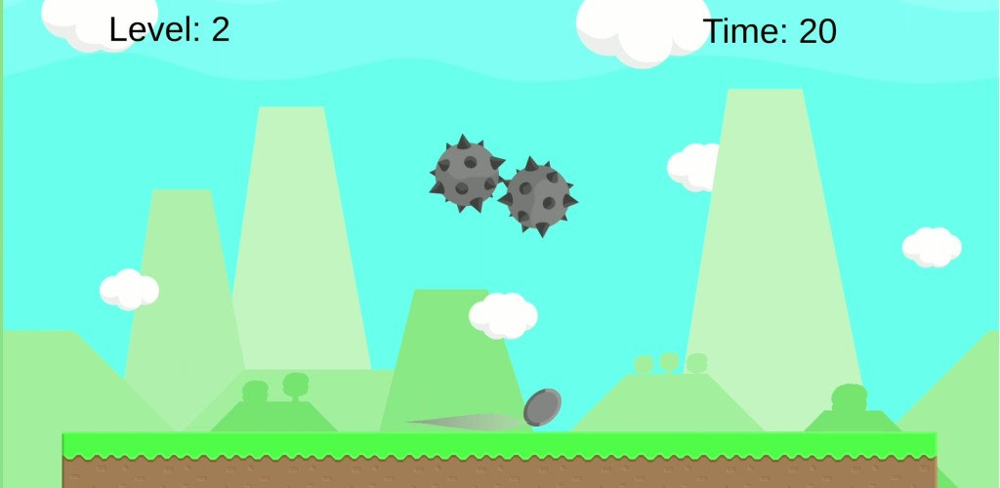
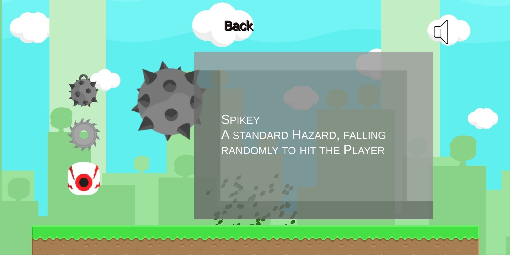
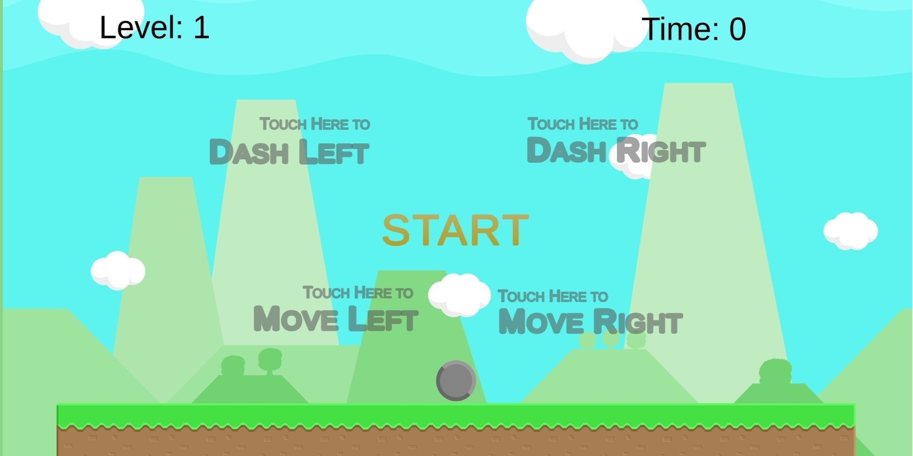
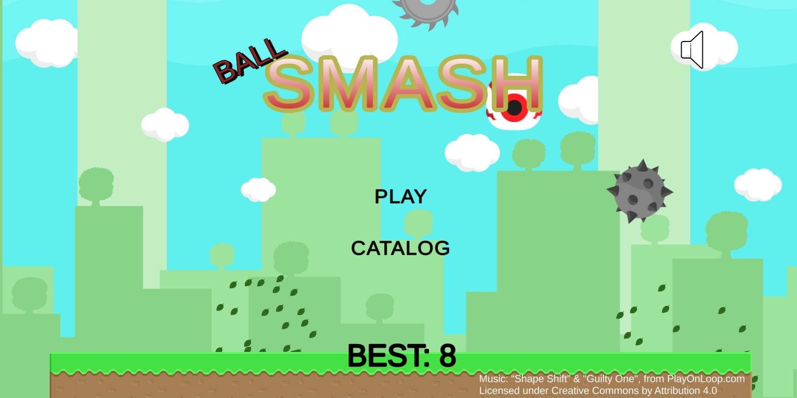

# SMASH
SMASH is a simple android game for mobile devices, its an endless obstacle dodging game with level progression system

## Gameplay
The difficulty of the game increases progressively with each level, initial levels are 15 seconds long while the later levels are 22 seconds long.
The Game Features three different types of hazards, and specific probability configurations for two among those three. These Hazard types can be accessed via the in-game catalog from the Start Menu.

Their catalog entries however fully unlock only after reaching a certain level.

## Controls
The Game is designed for android, so the controls are touch based...

Touching on the bottom-right side of the screen makes the player (ball) move right and vice versa, tapping on the upper halves however, makes the ball dash in the direction as indicated by the image.

## Menu and UI

The Menu and UI was created using the TextMeshPro package available in unity.

### Advertisements
Advertisements are integrated into the game, allowing player to revive by watching an advertisment, once every run. Banner ads are displayed when the player pauses a run and there is a 40% chance of (skippable) Video ad being played when the player loses, or exits back to the menu.

## Credits
### Sprites and Textures
The 5 sprites, background and environment used in the Game are the BayatGames asset package available for free in the Unity Asset Store.

### Sound

Music: “Shape Shift” & "Guilty One", from PlayOnLoop.com

Licensed under Creative Commons by Attribution 4.0

## Upload

The Game has been uploaded on the Playstore, but is currently under a pending review, and will soon be published following which it can be downloaded from there.
